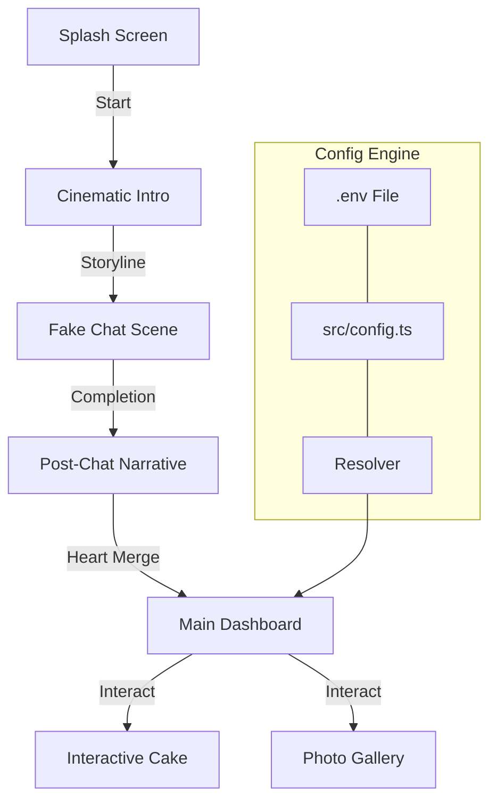

# 🌸 Birthday Bloom — Advanced Animated Birthday Website Generator

<div align="center">

> **"A premium digital experience crafted by Nishant Sarkar."**


<h3>✨ The Ultimate Open-Source Birthday Surprise Engine ✨</h3>

<p align="center">
  <a href="https://github.com/naborajs/birthday-bloom/stargazers"></a>
  <a href="https://github.com/naborajs/birthday-bloom/network/members"></a>
  <a href="https://github.com/naborajs/birthday-bloom/blob/main/LICENSE"></a>
  <a href="https://vercel.com"></a>
</p>

[**Live Demo**](https://birthday-bloom.vercel.app) • [**Env Guide**](./docs/ENV_GUIDE.md) • [**Documentation Hub**](./docs/getting-started.md)

</div>

---

## 🌟 Introduction

**Birthday Bloom** is a high-end, animated birthday surprise platform designed to create unforgettable digital moments. Built with **React 18**, **Framer Motion**, and **Tailwind CSS**, it features cinematic storytelling, physics-based interactions, and a premium aesthetic.

Developed by **Nishant Sarkar** (NS GAMMiNG), this project pushes the boundaries of web-based celebrations.

---

## 🏗️ System Architecture

Birthday Bloom operates as a finite state machine, orchestrating a multi-phase emotional journey.



---

## 📂 Folder Structure

| Directory | Description |
| :--- | :--- |
| `src/components/birthday` | Magic core: Cake, Intro, Hearts, Sparkles. |
| `src/assets` | Emotional payload: Photos and themed images. |
| `src/config` | Logic controllers for personalization. |
| `docs/` | Comprehensive knowledge base. |

---

## 🚀 Key Features

- **🎭 Cinematic Narrative**: Staggered text animations and "fake-chat" to build emotional tension.
- **❤️ Heart Convergence**: Physics-based merge animation symbolizing life's moments.
- **🎂 SVG Interactive Cake**: 4-layer physics cake with lighting, blowing, and cutting logic.
- **📱 Mobile-First**: Hardware-accelerated transitions for a smooth 60fps experience on all devices.
- **🔍 SEO Optimized**: Full Open Graph support for beautiful social sharing.

---

## ⚙️ Quick Personalization

1. **Clone & Install**:
   ```bash
   git clone https://github.com/naborajs/birthday-bloom.git
   npm install
   ```
2. **Configure**:
   Copy `.env.example` to `.env` and set `VITE_BIRTHDAY_NAME`.
3. **Deploy**:
   Push to GitHub and connect to Vercel for instant hosting.

*See the [ENV Guide](./docs/ENV_GUIDE.md) for detailed customization.*

---

## 🛠️ Technical Specifications

- **Performance**: Targeted 95+ Lighthouse scores via GPU offloading.
- **Animations**: Framer Motion orchestrates all physics and transitions.
- **Design**: Premium Glassmorphism using HSL color tokens.

---

## 👤 Author & Brand

Created with ❤️ by **Nishant Sarkar** (Nishant).
**Brand**: NS GAMMiNG
[YouTube](https://youtube.com/@Nishant_sarkar) • [GitHub](https://github.com/naborajs) • [Twitter](https://x.com/NSGAMMING699)

---

## 📜 License
Distributed under the **MIT License**.

*(Full documentation available in the [docs/](./docs/) folder)*
