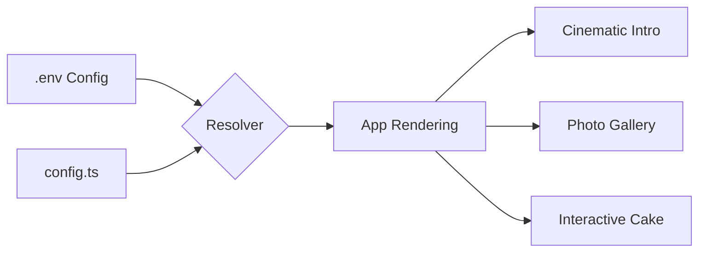

# 🌐 Environment & Personalization Guide

This guide explains how to fully customize **Birthday Bloom** using environment variables and configuration files.

## 🛠️ The Dual-Tier System

Birthday Bloom uses a prioritized configuration system:

1.  **Environment Variables (`.env`)**: Highest priority. Ideal for deployment on Vercel or local development without touching code.
2.  **Static Config (`src/config.ts`)**: Fallback priority. Good for hardcoding defaults.

---

## 🆔 Setting the Birthday Name

The name is resolved in this order:
`Process ENV` ➔ `src/config.ts` ➔ `"YOU"` (Default)

### Via `.env` (Recommended)
Add this to your `.env` file:
```bash
VITE_BIRTHDAY_NAME="Sarah"
```

---

## 🖼️ Managing Photos

You can manage photos in two ways: **Local Hosting** or **Cloud URLs**.

### 1. Cloud URLs (Easiest for Deployment)
Directly link to images hosted on the web (Unsplash, Imgur, etc.).
```bash
VITE_PHOTO_1="https://example.com/photo1.jpg"
VITE_PHOTO_2="https://example.com/photo2.jpg"
VITE_PHOTO_3="https://example.com/photo3.jpg"
```

### 2. Local Assets (Best for Offline)
1. Place your images in `src/assets/`.
2. Name them `photo1.jpg`, `photo2.jpg`, and `photo3.jpg`.
3. The app will automatically detect and use them if the ENV variables are empty.

---

## 🎵 Custom Background Music

To change the celebratory music, provide a direct URL to an `.mp3` or `.wav` file:
```bash
VITE_SOUND_URL="https://example.com/birthday-song.mp3"
```

---

## 🎨 Layout Illustration: Component Flow



---

## 🚀 Deployment Checklist

When deploying to **Vercel**:
1. Go to **Project Settings > Environment Variables**.
2. Add `VITE_BIRTHDAY_NAME`, `VITE_PHOTO_1`, etc.
3. Redeploy to apply changes.

> [!TIP]
> Always use `VITE_` prefix for variables to make them accessible in the React client.
